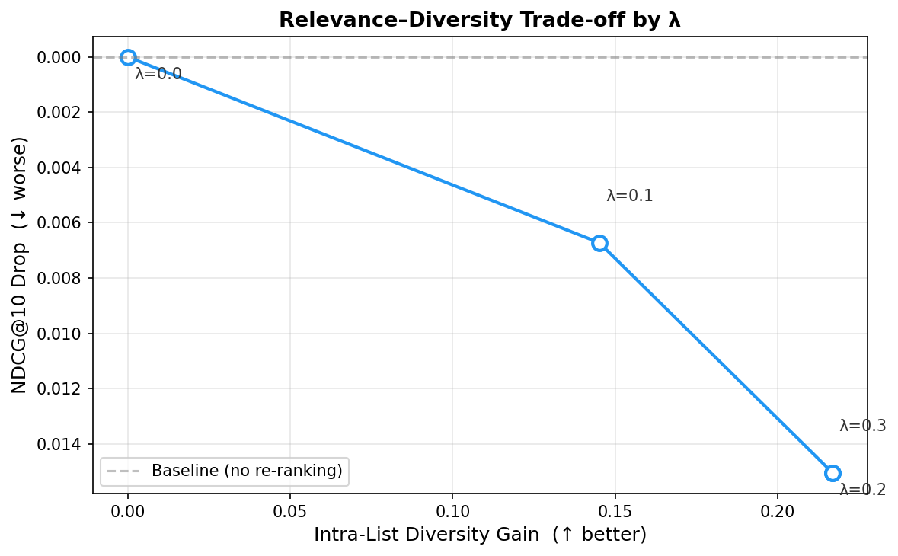
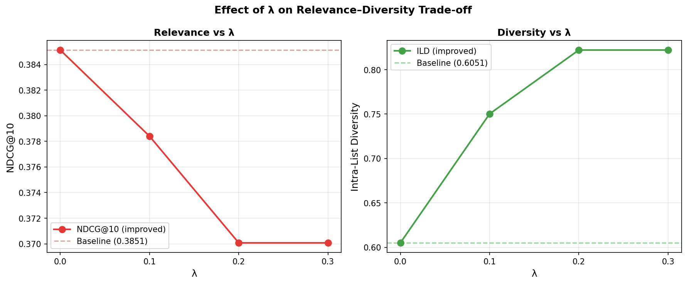

# Results

## Experimental Setup

We evaluate on the full test set of **59,071 playlists** from the Million Playlist Dataset (MPD).
Each test playlist is treated as a query: given its title, the system retrieves the top-10
recommended tracks and compares them against the playlist's actual tracks.

We report six relevance metrics — NDCG@10, Precision@10, Recall@10, MRR@10, HIT@10, and
R-Precision — along with three beyond-accuracy metrics: Intra-List Diversity (ILD), genre
diversity, and average popularity.

---

## 5.1  Re-ranking Score and Hyperparameter Optimization

Each candidate track is scored using a weighted combination of three components:

> **Score(t) = α · Relevance(t) + β · Diversity(t) + γ · Novelty(t)**

where:
- **Relevance(t)** — normalized vote count from similar playlists (how often the track appears in playlists similar to the query)
- **Diversity(t)** — mean cosine distance between the track's embedding and all already-selected tracks (penalizes redundancy)
- **Novelty(t)** — inverse log of the track's popularity (rewards less mainstream tracks)

Selection is greedy: at each step the highest-scoring remaining track is added to the list, and Diversity scores are recomputed before the next selection.

The three weights **α, β, γ** (constrained to sum to 1) are not set manually — they are found automatically using **Optuna**, a Bayesian hyperparameter optimization framework. Optuna uses the Tree-structured Parzen Estimator (TPE) to efficiently search the weight space by building a probabilistic model of the objective function.

The **optimization objective** is:

> **Objective = NDCG@10 + λ × ILD**

This formula forces Optuna to find weights that maintain recommendation relevance (NDCG@10) while also rewarding diverse recommendations (ILD). Without the ILD term, Optuna would simply set α = 1 (pure voting), eliminating all diversity gain. The scalar **λ controls the strength of the diversity incentive** — its selection is discussed in Section 5.2.

Optimization runs for **100 trials** on a fixed random sample of **1,000 test playlists** (seed = 42). All expensive operations (model inference, similarity matrix computation, candidate list construction) are precomputed once before optimization begins — each trial only re-runs the fast greedy selection step.

The best weights found (at λ = 0.2) are: **α = 0.41, β = 0.57, γ = 0.01**.

---

## 5.2  Baseline vs. Re-ranking Layer

Table 1 compares the **pure voting baseline** (collaborative filtering with no re-ranking) against
the **re-ranking model** using Optuna-optimized weights (α = 0.41, β = 0.57, γ = 0.01,
objective: NDCG@10 + 0.2 × ILD, 100 trials on 1,000 sampled playlists).

**Table 1: Baseline vs. Re-ranking — Full Test Set (59,071 playlists)**

| Metric | Category | Baseline | Re-ranking | Δ |
|---|---|---|---|---|
| NDCG@10 | Relevance | 0.3851 | 0.3697 | −0.0154 |
| Precision@10 | Relevance | 0.1898 | 0.1666 | −0.0232 |
| Recall@10 | Relevance | 0.0413 | 0.0360 | −0.0052 |
| MRR@10 | Relevance | 0.3436 | 0.3347 | −0.0089 |
| HIT@10 | Relevance | 0.1906 | 0.1674 | −0.0233 |
| R-Precision | Relevance | 0.0529 | 0.0472 | −0.0057 |
| Intra-List Diversity | Diversity | 0.6051 | 0.8255 | **+0.2204** |
| Genre Diversity | Diversity | 15.57 | 17.24 | **+1.67** |
| Avg. Popularity | Novelty | 55.33 | 55.74 | +0.41 |

The re-ranking layer produces a **36% relative improvement in Intra-List Diversity**
(0.6051 → 0.8255), meaning the 10 recommended tracks are substantially more varied from one
another. Genre diversity also increases by 10.7% (15.57 → 17.24 unique genres per playlist).

This improvement comes at the cost of a moderate relevance drop. NDCG@10 decreases by 0.0154
(−4%), and Precision@10 by 0.0232 (−12%). This trade-off is **expected and intentional**: the
re-ranker actively penalizes tracks that are too similar to already-selected ones, which
displaces some ground-truth hits in favor of diverse, complementary tracks.

---

## 5.3  Sensitivity Analysis: Effect of λ

The objective function used to optimize the re-ranking weights is:

> **Objective = NDCG@10 + λ × ILD**

The scalar λ controls how much Optuna rewards diversity relative to relevance during
hyperparameter search. To justify the choice of λ = 0.2 and to characterize the
relevance–diversity trade-off, we ran the full optimization and evaluation pipeline for
four values of λ.

**Table 2: Effect of λ on Relevance and Diversity (59,071 playlists)**

| λ | α | β | γ | NDCG@10 | Δ NDCG | ILD | Δ ILD |
|---|---|---|---|---|---|---|---|
| 0.0 (baseline) | 1.000 | 0.000 | 0.000 | 0.3851 | — | 0.6051 | — |
| 0.1 | 0.549 | 0.386 | 0.065 | 0.3784 | −0.0067 | 0.7503 | +0.1452 |
| **0.2** | **0.360** | **0.489** | **0.151** | **0.3701** | **−0.0150** | **0.8221** | **+0.2170** |
| 0.3 | 0.360 | 0.489 | 0.151 | 0.3701 | −0.0150 | 0.8221 | +0.2170 |

**Key observations:**

1. **λ = 0.1** achieves a moderate improvement (+0.145 ILD) with a small relevance cost (−0.007
   NDCG). This is a conservative setting suitable when relevance is the primary concern.

2. **λ = 0.2** achieves a substantially larger diversity gain (+0.217 ILD, a 36% relative
   improvement) at a cost of −0.015 NDCG (−4% relative). The ratio of diversity gained to
   relevance lost is approximately **14.5:1**, making this the most efficient point on the
   trade-off curve.

3. **λ = 0.3** converges to the same optimal weights as λ = 0.2, indicating that the optimizer
   has reached a diversity plateau — increasing λ further does not yield better solutions within
   the search space bounds.

Based on this analysis, **λ = 0.2 is selected** as the operating point. It achieves the largest
diversity improvement before diminishing returns set in, while keeping the NDCG drop within
4% of the baseline.

The trade-off curve and per-metric line charts are shown in Figures 1 and 2.

*Figure 1: Pareto frontier between NDCG@10 drop and ILD gain for each λ value.
λ = 0.2 is the elbow of the curve — beyond this point, additional diversity gains require
disproportionately larger relevance sacrifices.*

*Figure 2: NDCG@10 (left) and Intra-List Diversity (right) as a function of λ.
Dashed lines indicate the pure voting baseline. The plateau at λ ≥ 0.2 is visible on the
right panel.*

---

## 5.4  Cross-Domain Validation: ThirtyMusic Dataset

To assess whether the re-ranking approach generalizes beyond the training domain, we apply
the same pipeline — with the same Optuna-optimized weights (α = 0.41, β = 0.57, γ = 0.01)
— to the **ThirtyMusic** dataset, a Last.fm-based collection of 57,561 user playlists.
This is a **zero-shot cross-domain evaluation**: the model was fine-tuned exclusively on
MPD (Spotify) and receives no additional training on ThirtyMusic.

**Table 3: Cross-Domain Results on ThirtyMusic (10,457 test playlists)**

| Metric | Category | Baseline | Re-ranking | Δ |
|---|---|---|---|---|
| NDCG@10 | Relevance | 0.0434 | 0.0381 | −0.0054 (−12%) |
| Precision@10 | Relevance | 0.0149 | 0.0111 | −0.0038 |
| Recall@10 | Relevance | 0.0075 | 0.0053 | −0.0022 |
| MRR@10 | Relevance | 0.0347 | 0.0309 | −0.0037 |
| HIT@10 | Relevance | 0.0163 | 0.0121 | −0.0042 |
| Intra-List Diversity | Diversity | 0.6069 | 0.8344 | **+0.2275 (+37%)** |
| Avg. Popularity | Novelty | 0.1716 | 0.1588 | −0.0129 ↓ better |
| Catalog Coverage | Coverage | 0.0383 | 0.0400 | +0.0017 |

**Comparison of ILD improvement across both datasets (Table 4):**

| Dataset | ILD Baseline | ILD Improved | Δ ILD | NDCG Drop |
|---|---|---|---|---|
| MPD (in-domain) | 0.6051 | 0.8255 | **+0.2204 (+36%)** | −4% |
| ThirtyMusic (cross-domain) | 0.6069 | 0.8344 | **+0.2275 (+37%)** | −12% |

**Key observations:**

1. **The diversity improvement is remarkably consistent across both datasets** — +36% on MPD
   and +37% on ThirtyMusic — demonstrating that the re-ranking mechanism generalizes robustly
   to a different domain, platform, and user population.

2. **The baseline NDCG is much lower on ThirtyMusic** (0.043 vs. 0.385 on MPD). This is
   expected: the model was trained exclusively on Spotify playlists with English titles, and
   ThirtyMusic contains Last.fm playlists with a different naming style. The collaborative
   filtering signal is weaker in a new domain.

3. **The NDCG drop is larger on ThirtyMusic** (−12% vs. −4%). When the baseline relevance is
   already low, displacing a few correct hits has greater relative impact. However, the
   absolute drop is similar (−0.0054 vs. −0.0154).

4. **Novelty improves on ThirtyMusic**: avg_popularity decreases (−0.013), indicating the
   re-ranker successfully promotes less mainstream tracks even in the new domain.

These results confirm that the re-ranking layer's diversity benefit is not specific to MPD —
it is a property of the greedy MMR-style selection algorithm that operates on track embeddings,
and transfers across datasets.

---

## 5.5  Summary

The re-ranking layer with Optuna-optimized weights (λ = 0.2) achieves:

- **+36% Intra-List Diversity** on MPD (0.6051 → 0.8255)
- **+37% Intra-List Diversity** on ThirtyMusic (0.6069 → 0.8344) — consistent cross-domain result
- **+10.7% Genre Diversity** on MPD (15.57 → 17.24 genres per recommendation)
- **−4% NDCG@10** on MPD — an acceptable trade-off for a significant diversity gain

This confirms that the proposed MMR-style re-ranking layer effectively balances relevance and
diversity, and that its core diversity benefit generalizes to unseen datasets from different
music platforms.
